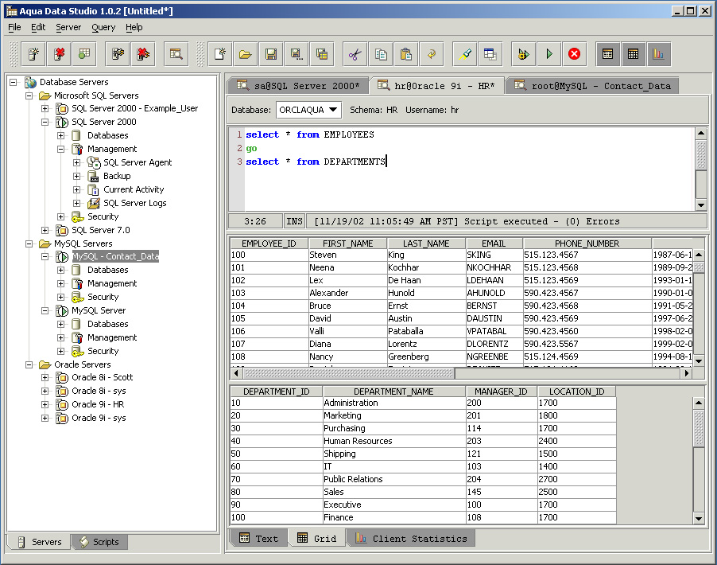



## Aqua Studio Freeware

### Description

Please check it out. It is a good tool.
 
### More Info
 

             |
---                |---
**Submitted On**   |
**By**             |[foxsermon](https://github.com/Planet-Source-Code/PSCIndex/blob/master/ByAuthor/foxsermon.md)
**Level**          |Beginner
**User Rating**    |4.0 (8 globes from 2 users)
**Compatibility**  |VB 6\.0
**Category**       |[Databases/ Data Access/ DAO/ ADO](https://github.com/Planet-Source-Code/PSCIndex/blob/master/ByCategory/databases-data-access-dao-ado__1-6.md)
**World**          |[Visual Basic](https://github.com/Planet-Source-Code/PSCIndex/blob/master/ByWorld/visual-basic.md)
**Archive File**   |

### Source Code

I found this freeware when I was trying to get something
good and of course FREE, by the way I tried with DBArtisan, Toad
and another stuff done by Programmers Sr. but I think this tool
Aqua Studio is real good, you can work with Orale, SQL Server,
MySQL. It is done with Java.
  
I just want to share the resoucer with all you guys, because
I guess there is someone out there who is looking for a Free
good tool.
  
Here is the link <a href="http://www.aquafold.com/">Aqua Studio</a>
  
I know there will be a few or one cranky guy who want to be against this
article, but I just want to apologize for uploading it.

